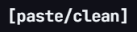
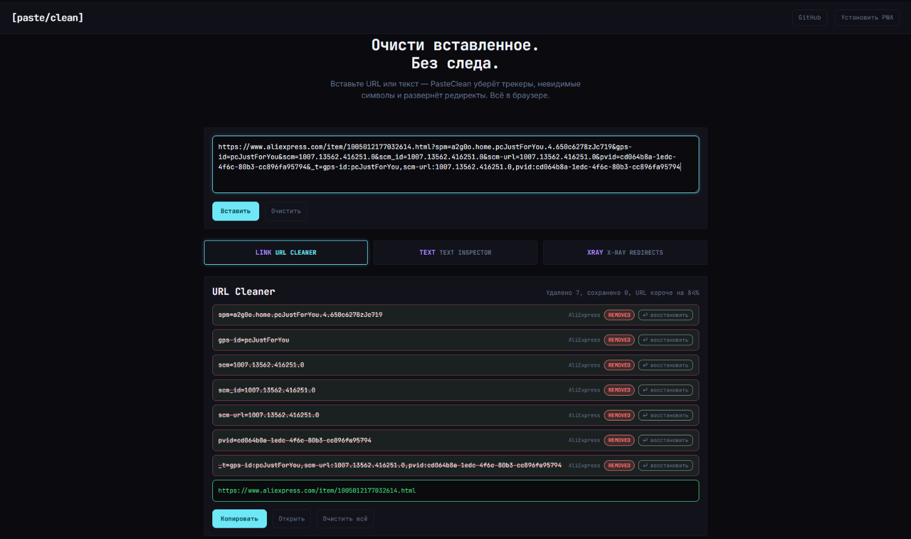

<p align="center">
  
</p>

<h1 align="center">PasteClean</h1>

<p align="center">
  Очистка URL и текста от трекеров и невидимых символов.<br>
  Без сервера. Без логов. Без аккаунтов.
</p>

<p align="center">
  <a href="README.en.md">English</a>
  &nbsp;·&nbsp;
  <a href="https://github.com/ragar7design-wq/paste-clean/releases">Releases</a>
  &nbsp;·&nbsp;
  <a href="LICENSE">MIT License</a>
</p>

<p align="center">
  
</p>

---

## Что это

**PasteClean** — это веб-инструмент, который очищает то, что вы вставляете, от слежки и скрытых символов. Всё работает прямо в браузере: URL Cleaner и Text Inspector полностью клиентские, данные никогда не покидают ваше устройство. Инструмент устанавливается как PWA и работает офлайн.

Три режима в одном окне:

- **URL Cleaner** — удаляет отслеживающие параметры из ссылок (`utm_*`, `fbclid`, `gclid`, `msclkid`, `spm`, `scm`, `pvid` и **200+ других**), распаковывает вложенные редиректы, сохраняет реальные якоря.
- **Text Inspector** — находит и удаляет невидимые Unicode-символы (zero-width space, ZWNJ, ZWJ, word joiner, BOM, soft hyphen, LTR/RTL marks) и выявляет homoglyph-смеси (кириллица + латиница в одном слове).
- **X-Ray Redirects** — разворачивает цепочку редиректов коротких ссылок (`bit.ly`, `tinyurl.com`, `t.co`, `goo.su` и др.), показывает статус-код, домен и безопасность каждого хопа, детектирует подозрительные переходы.

---

## Возможности

### URL Cleaner
Удаляет отслеживающие параметры из URL. База основана на [ClearURLs](https://gitlab.com/anti-tracking/ClearURLs/rules) и регулярно обновляется.

- Поддержка regex-паттернов (`utm_*`, `pf_rd_*`, `hc_*` и др.)
- Домен-специфичные правила (Amazon, YouTube, AliExpress, Bilibili и др.)
- Распаковка вложенных URL из redirect-параметров (`continue`, `url`, `q`)
- Сохранение реальных anchor-фрагментов (`#section`)
- Отмена удаления конкретного параметра в один клик

### Text Inspector
Находит и удаляет невидимые Unicode-символы:
- Zero-width space (`U+200B`), ZWNJ (`U+200C`), ZWJ (`U+200D`)
- Word joiner, BOM, soft hyphen, LTR/RTL marks
- Homoglyph-смеси (кириллица + латиница в одном слове)

### X-Ray Redirects
Разворачивает цепочку редиректов коротких ссылок:
- `goo.su`, `bit.ly`, `tinyurl.com`, `t.co` и другие
- Показывает полный путь: статус-код, домен, безопасность каждого хопа
- Детекция подозрительных переходов (IP-адреса, циклы, 5+ редиректов)
- Серверный прокси — без браузерных CORS-блокировок

### PWA
Устанавливается как приложение, работает офлайн (кроме X-Ray).

---

## Установка одной командой (сервер)

Самый простой способ поднять PasteClean на собственном сервере — выполнить установочный скрипт. Он сам установит Node.js, Nginx, клонирует репозиторий, соберёт статику, настроит systemd и Nginx.

### Быстрый старт

```bash
sudo bash -c "$(curl -fsSL https://raw.githubusercontent.com/ragar7design-wq/paste-clean/main/install.sh)"
```

Это установит PasteClean с параметрами по умолчанию:
- Директория: `/opt/paste-clean`
- Публичный порт: `8080`
- Внутренний порт приложения: `9080`
- Сайт доступен по адресу: `http://<IP-вашего-сервера>:8080`

### С указанием домена и порта

```bash
sudo bash -c "$(curl -fsSL https://raw.githubusercontent.com/ragar7design-wq/paste-clean/main/install.sh)" _ example.com 8080
```

Первый аргумент — домен (`_` = любой хост/IP), второй — публичный порт.

### Что делает установщик

1. Устанавливает системные пакеты (`git`, `nginx`, `curl`) через ваш пакетный менеджер (apt/dnf/yum/apk).
2. Ставит Node.js 20, если он не установлен.
3. Клонирует репозиторий в `/opt/paste-clean` (или обновляет, если уже клонирован).
4. Собирает статику (`npm install && node scripts/build.mjs`).
5. Создаёт systemd-юнит `paste-clean.service` и запускает приложение.
6. Генерирует Nginx-сайт с подставленными портами и доменом, включает его и перезагружает Nginx.

Скрипт идемпотентен — его можно запускать повторно для обновления.

### HTTPS (опционально)

После установки с доменом добавьте бесплатный TLS-сертификат через Let's Encrypt:

```bash
sudo apt-get install -y certbot python3-certbot-nginx
sudo certbot --nginx -d example.com
```

### Управление на сервере

```bash
sudo systemctl restart paste-clean     # перезапуск приложения и X-Ray API
sudo systemctl reload  nginx           # перезагрузка Nginx
sudo journalctl -u paste-clean -f      # логи приложения
sudo systemctl status paste-clean       # статус приложения
```

### Обновление

```bash
sudo bash -c "$(curl -fsSL https://raw.githubusercontent.com/ragar7design-wq/paste-clean/main/install.sh)" _ example.com 8080
```

Повторный запуск подтянет свежий код, пересоберёт статику и перезапустит сервисы.

---

## Локальный запуск (разработка)

Если вы хотите запустить PasteClean на своей машине без сервера:

```bash
git clone https://github.com/ragar7design-wq/paste-clean.git
cd paste-clean
npm install
npm run dev      # локальный сервер на http://localhost:5173
```

`npm run dev` поднимает статический сервер и X-Ray API одновременно.

### Сборка статики

```bash
npm run build    # копирует src/css и src/js в public/
```

### Тесты

```bash
npm test         # node --test src/js/modules/*.test.mjs
```

---

## Стек

| Компонент | Технология |
|---|---|
| Frontend | Vanilla JS (ES2022), CSS Custom Properties |
| Styling | Tailwind CSS 3.4 (CDN) |
| Fonts | Inter + JetBrains Mono |
| Backend | Node.js (X-Ray redirect resolver + статика) |
| Server | Nginx |
| Process manager | systemd |
| TLS | Let's Encrypt (certbot, опционально) |

## Дизайн

Dark brutalism + glassmorphism. Монохромная палитра с акцентом cyan (`#6EE7F7`).

---

## Структура проекта

```
paste-clean/
├── assets/
│   ├── logo.png              # Логотип
│   └── screenshot.png        # Скриншот для README
├── deploy/
│   └── nginx.conf            # Шаблон Nginx-конфигурации (подстановки install.sh)
├── install.sh                # Установочный скрипт одной командой
├── public/                   # Собираемая статика (отдаётся Nginx)
│   ├── index.html            # Главная страница
│   ├── manifest.json         # PWA-манифест
│   ├── sw.js                 # Service Worker
│   ├── robots.txt
│   └── favicon/icon.svg      # Иконка
├── scripts/
│   ├── build.mjs             # Сборка статики (src → public)
│   ├── dev.mjs               # Дев-сервер + API одной командой
│   ├── dev-server.mjs        # Статический дев-сервер с прокси на API
│   └── server.mjs            # Прод-сервер: статики + /api/xray
├── src/
│   ├── css/                  # Стили (main, components, animations)
│   └── js/
│       ├── app.js            # Точка входа приложения
│       ├── data/
│       │   └── trackers.js  # База трекеров (200+ параметров)
│       └── modules/
│           ├── urlCleaner.js    # Очистка URL
│           ├── textInspector.js # Инспектор текста
│           ├── xray.js          # Разворот редиректов (клиент)
│           ├── clipboard.js     # Работа с буфером обмена
│           ├── ui.js            # UI-компоненты
│           └── analytics.js     # Внутренняя аналитика (события, без сети)
└── package.json
```

---

## Приватность

- URL Cleaner и Text Inspector — **полностью клиентские**, данные не покидают браузер.
- X-Ray использует серверный прокси для разворота редиректов. URL **не сохраняются** — запрос обрабатывается в памяти и сразу отбрасывается.
- Никакого localStorage для пользовательских данных.
- Никаких cookies, внешней аналитики или трекеров на самом сайте.
- `analytics.js` диспатчит только локальные `CustomEvent` внутри страницы — ничего не отправляется в сеть.

## Источники базы трекеров

- [ClearURLs](https://gitlab.com/anti-tracking/ClearURLs/rules) — LGPL-3.0
- [Neat URL](https://github.com/Smile4ever/Neat-URL)
- [tracklessURL](https://github.com/col1010/tracklessURL)
- Ручные дополнения для российских платформ (Дзен, Яндекс)

---

## Лицензия

MIT — см. [LICENSE](LICENSE).